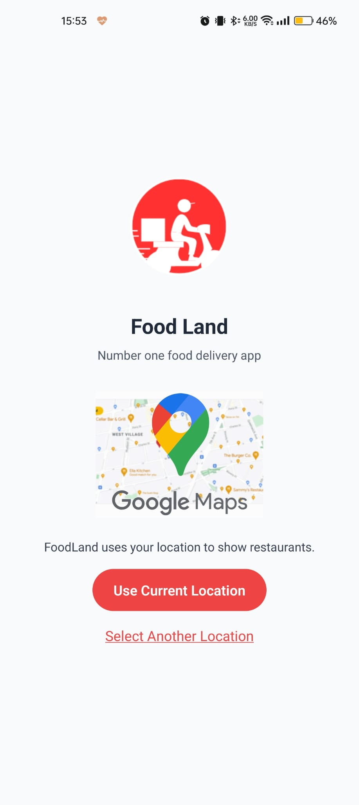
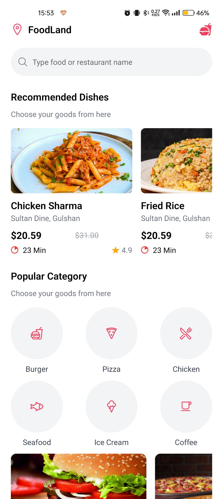
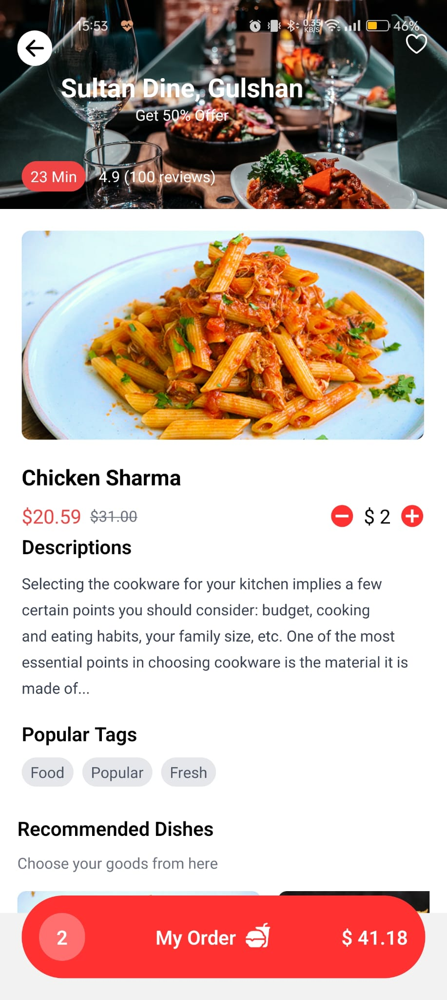
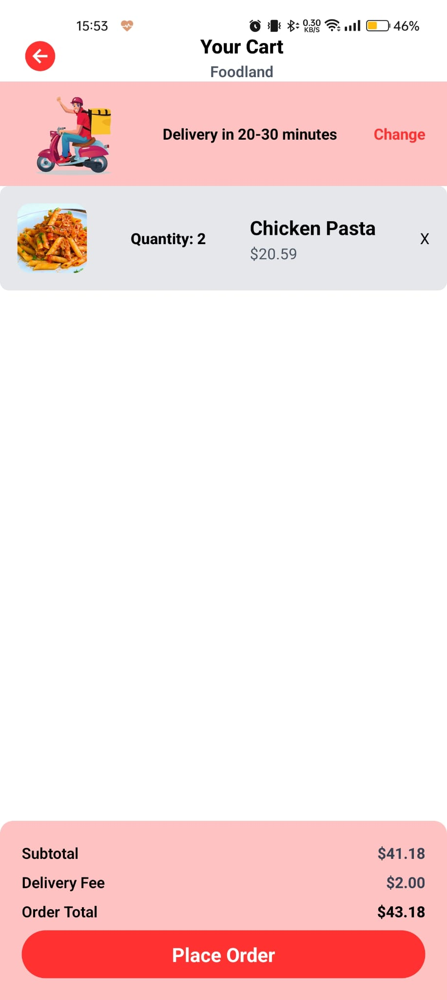
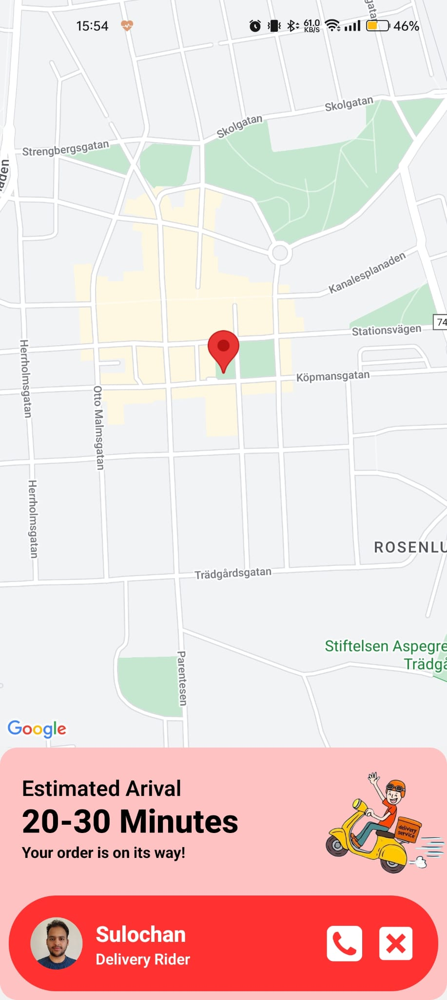

<!DOCTYPE html>
<html lang="en">
<head>
    <meta charset="UTF-8">
    <meta name="viewport" content="width=device-width, initial-scale=1.0">
</head>
<body>

<h1>🍔 FoodLand - Mobile Food Ordering App</h1>

<video controls width="600">
    <source src="./picture/video.mp4" type="video/mp4">
    Your browser does not support the video tag.
</video>

<h2>🖼️ Screenshots</h2>

Below are some screenshots of the app:

  
    
    
    
    
    
    

    Welcome to <strong>FoodLand</strong>, a mobile application built using React Native and styled with Tailwind CSS. 
    FoodLand allows users to browse food items, add them to their cart, and proceed to the delivery screen to complete their order.

<h2>📱 Features</h2>
<ul>
    <li>Browse a wide selection of food items</li>
    <li>Add items to the cart</li>
    <li>Proceed to the delivery screen</li>
    <li>Responsive design for various screen sizes</li>
</ul>

<h2>🚀 Getting Started</h2>

    Follow these instructions to get a copy of the project up and running on your local machine for development and testing purposes.

<h3>Prerequisites</h3>
<ul>
    <li><a href="https://nodejs.org/" target="_blank">Node.js</a> (v12.x or higher)</li>
    <li><a href="https://reactnative.dev/docs/environment-setup" target="_blank">React Native CLI</a></li>
    <li>Tailwind CSS</li>
</ul>

<h3>Installation</h3>
<pre>
<code>
# Clone the repository
git clone https://github.com/sulochanbarakoti/foodland--Food-Delivery-App-

# Navigate to the project directory
cd foodland-app

# Install dependencies
npm install

# Run the application
npm run android   # For Android
npm run ios       # For iOS
</code>
</pre>

<h2>🛠️ Built With</h2>
<ul>
    <li><a href="https://reactnative.dev/" target="_blank">React Native</a> - JavaScript framework for building mobile apps</li>
    <li><a href="https://tailwindcss.com/" target="_blank">Tailwind CSS</a> - Utility-first CSS framework</li>
</ul>

<h2>📄 License</h2>

    This project is licensed under the MIT License - see the <a href="LICENSE">LICENSE</a> file for details.

</body>
</html>
